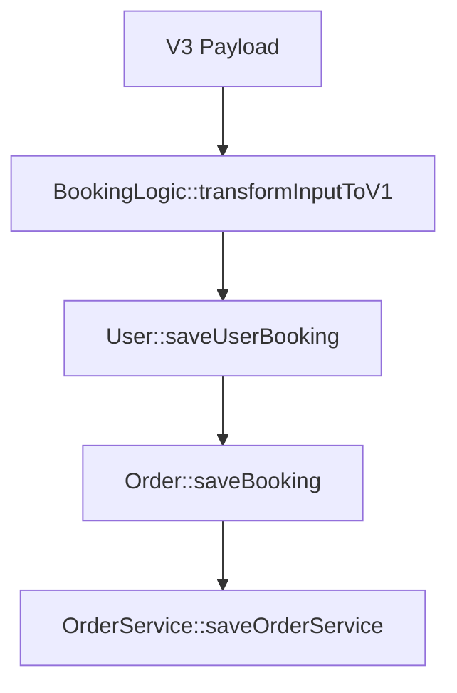

# 📅 Wings AI Booking Creation Logic (V3) - Delegated Architecture

**API Endpoint**: `POST /3/booking/create`
**Context**: This endpoint has been refactored to serve as a comprehensive wrapper around the core Legacy (V1) Models. It prioritizes **Correctness** and **Consistency** over raw performance by ensuring all system side effects (reporting, merging, double-booking checks) are triggered exactly as they are in the legacy system.

## 1. High-Level Architecture

The logic is now a simple delegation pipeline:



## 2. Process Flow & Mappings

### Step 1: Data Transformation

The V3 input is mapped to V1 model expectations:

| Field                 | Type       | Description                                                                                                         |
| :-------------------- | :--------- | :------------------------------------------------------------------------------------------------------------------ |
| `store_id`            | `integer`  | Store location ID.                                                                                                  |
| `start_time`          | `datetime` | Scheduled start (YYYY-MM-DD HH:mm:ss).                                                                              |
| `services`            | `array`    | List of service IDs. If omitted, defaults to **Service ID 1**.                                                      |
| `phone`               | `string`   | Primary identifier. **Required**.                                                                                   |
| `session_token`       | `string`   | Valid User Access Token (from login). If provided, identifies the **Creator** (e.g., Staff on App).                 |
| `created_by_staff_id` | `integer`  | Explicit staff ID to attribute creation to. Useful for payroll/bonuses if different from token owner.               |
| `technician_id`       | `integer`  | The ID of the assigned technician. If omitted, the system will treat it as "Any" or assign a random available tech. |
| `full_name`           | `string`   | Required if creating a new user. Ignored if user exists.                                                            |
| `note`                | `string`   | Optional booking notes.                                                                                             |
| **(Internal)**        | `integer`  | Hardcoded to `11` (`client_id`).                                                                                    |
| **(Internal)**        | `array`    | Hardcoded to `['App']` (`booking_channels`).                                                                        |

### Step 2: Client Identity (`User::saveUserBooking`)

- **Behavior**: Identical to Legacy. logic.
- **Defaults**: Uses system defaults (Gender 202, Group 1) if creating a new user.

### Step 3: Order Transaction (`Order::saveBooking`)

- **Critical Feature**: This method includes `Order::mergeOrder`.
- **Double Booking**: If a user already has an unconfirmed order for the same day, this logic will **merge** the new request into the existing order instead of creating a duplicate.
- **Side Effects**:
  - Generates accurate `order_key`.
  - Triggers `generate-report-order.php` (Revenue Reports).
  - Triggers `FirestoreService` sync (Live Board).

### Step 4: Service Attachment (`OrderService::saveOrderService`)

- **Pricing**: Full pricing logic is executed (calculating base prices, even if 0).
- **Staff Assignment**: Services are assigned to the resolved technician.
- **Optionality**: If `services` is empty array:
  - Defaults to `[1]`.
  - Duration and Price are calculated based on Service ID 1.

---

## 3. "Any Technician" Logic

If `technician_id` is not provided (or 0):

1.  **Selection**: A random active technician (Group 4) from the store's pool is selected via `ORDER BY RAND()`.
2.  **Assignment**: This selected ID is passed as `assigned_staff_id` to both the Order and key Service records.

## 4. Key Differences from Previous V3

> [!IMPORTANT]
> **Performance Note**: This version is slower than the raw SQL version because it triggers the full weight of the Phalcon ORM and synchronous report generation.
> **Correctness**: It guarantees 100% data parity with the internal admin panel booking flow.

## 5. Concrete Usage Examples

Below are concrete `curl` examples for testing the API on both **Orb (Local)** and **Live (Production)** environments.

> [!NOTE]
> Replace `YYYY-MM-DD HH:MM:SS` with a valid future date/time.
> Replace `X-Wings-Token` with the correct value for the environment.

### Scenario A: New Client (Create Profile + Booking)

When a phone number is not found in the database, the system creates a new user profile using the provided `full_name`.

#### 1. Orb (Local)

```bash
curl -X POST "http://api.orb/3/booking/create" \
     -H "Content-Type: application/json" \
     -d '{
           "session_token": "YOUR_VALID_ACCESS_TOKEN_HERE",
           "phone": "0991112222",
           "full_name": "Test New User",
           "store_id": 2,
           "start_time": "2026-03-01 10:00:00",
           "services": [4],
           "note": "First time booking from API"
         }'
```

#### 2. Live (Production)

```bash
curl -X POST "https://api.wingslashes.com/3/booking/create" \
     -H "Content-Type: application/json" \
     -d '{
           "session_token": "YOUR_VALID_ACCESS_TOKEN_HERE",
           "phone": "0991112222",
           "full_name": "Test New User",
           "store_id": 2,
           "start_time": "2026-03-01 10:00:00",
           "services": [4],
           "note": "First time booking from API"
         }'
```

---

### Scenario B: Existing Client (Booking Only)

When the phone number exists, the system attaches the booking to that user. `full_name` is optional (system uses the existing name).

#### 1. Orb (Local)

```bash
curl -X POST "http://api.orb/3/booking/create" \
     -H "Content-Type: application/json" \
     -d '{
           "session_token": "YOUR_VALID_ACCESS_TOKEN_HERE",
           "phone": "0938633944",
           "store_id": 2,
           "start_time": "2026-03-01 14:00:00",
           "services": [4, 6],
           "technician_id": 51756,
           "note": "Regular VIP booking"
         }'
```

#### 2. Live (Production)

```bash
curl -X POST "https://api.wingslashes.com/3/booking/create" \
     -H "Content-Type: application/json" \
     -d '{
           "session_token": "YOUR_VALID_ACCESS_TOKEN_HERE",
           "phone": "0938633944",
           "store_id": 2,
           "start_time": "2026-03-01 14:00:00",
           "services": [4, 6],
           "technician_id": 51756,
           "note": "Regular VIP booking"
         }'
```

---

### Scenario C: Authenticated Staff Booking

When a Staff member creates a booking via the App, use their `session_token`. This ensures the `created_by` field is correctly attributed to them. `phone` is still required to identify the client.

#### 1. Orb (Local)

```bash
curl -X POST "http://api.orb/3/booking/create" \
     -H "Content-Type: application/json" \
     -d '{
           "session_token": "YOUR_VALID_ACCESS_TOKEN_HERE",
           "created_by_staff_id": 86,
           "phone": "0991112222",
           "store_id": 2,
           "start_time": "2026-03-01 16:00:00",
           "services": [4],
           "note": "Booked by Staff (Authenticated)"
         }'
```

#### 2. Live (Production)

```bash
curl -X POST "https://api.wingslashes.com/3/booking/create" \
     -H "Content-Type: application/json" \
     -d '{
           "session_token": "YOUR_VALID_ACCESS_TOKEN_HERE",
           "phone": "0991112222",
           "store_id": 2,
           "start_time": "2026-03-01 16:00:00",
           "services": [4],
           "note": "Booked by Staff (Authenticated)"
         }'
```
