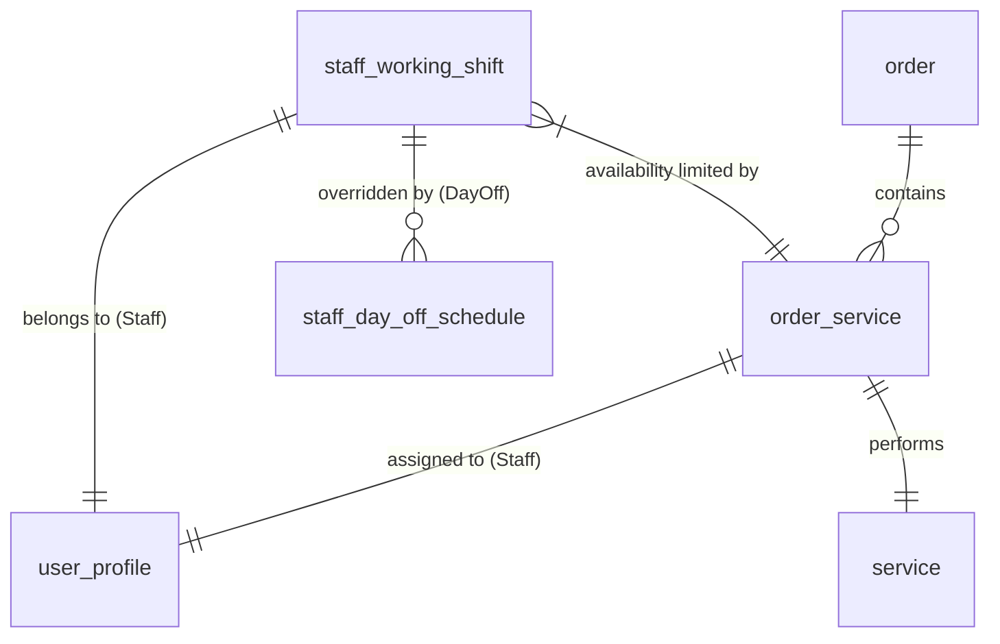

# Wings AI Booking Slots API Specification

## Overview

The booking slots API provides real-time availability data for booking appointments at Wings Lashes stores. It supports filtering by store, date range, and optionally by specific technicians.

---

## API Endpoint

**Path**: `/3/booking/slots/available`

**Method**: `GET`

**Base URLs**:
- **Orb (Development)**: `http://api.orb`
- **Live (Production)**: `https://api.wingslashes.com`

---

## Request Parameters

| Parameter | Type | Required | Description | Example |
|-----------|------|----------|-------------|---------|
| `storeId` | string/int | ✅ Yes | Store ID or alias (case-insensitive) | `2`, `PXL`, `De Tham`, `Estella Place` |
| `from` | string | ✅ Yes | Start date (YYYY-MM-DD) | `2026-02-01` |
| `to` | string | ✅ Yes | End date (YYYY-MM-DD) | `2026-02-07` |
| `session_token` | string | ✅ Yes | Authentication token | User's session token |
| `technicianIds` | string | ❌ No | Comma-separated technician IDs to filter | `101,102,105` |

### Store ID Mapping

| Store Name | Numeric ID | Accepted Aliases |
|------------|------------|------------------|
| Phan Xích Long (Phú Nhuận) | `2` | `PXL`, `Phan Xich Long` |
| Đề Thám (Quận 1) | `6` | `DT`, `De Tham`, `Đề Thám` |
| Estella Place (Quận 2) | `16` | `EP`, `Estella Place`, `Estella` |

### Sample Request URLs

**All Technicians (Aggregate)**:
```
http://api.orb/3/booking/slots/available?storeId=PXL&from=2026-02-01&to=2026-02-07&session_token=TOKEN
```

**Specific Technician(s)**:
```
http://api.orb/3/booking/slots/available?storeId=2&from=2026-02-01&to=2026-02-01&technicianIds=101,102&session_token=TOKEN
```

---

## Response Format

### Success Response

```json
{
  "status": "success",
  "data": {
    "store_id": 2,
    "technician_ids": [101, 102],
    "from": "2026-02-01",
    "to": "2026-02-07",
    "dates": {
      "2026-02-01": {
        "slots": {
          "09:00": 5,
          "09:15": 3,
          "09:30": 0,
          "09:45": -1,
          "10:00": 8
        }
      },
      "2026-02-02": {
        "slots": {
          "09:00": 4,
          "09:15": 2
        }
      }
    }
  }
}
```

### Availability Count Interpretation

| Count Value | Meaning | Example |
|-------------|---------|---------|
| **Positive** (>0) | Number of available technicians | `+5` = 5 techs free |
| **Zero** (0) | Fully booked | `0` = No availability |
| **Negative** (<0) | Overbooked count | `-2` = 2 bookings over capacity |

### Filtering Behavior

#### Without `technicianIds` (Aggregate Mode)
Returns **total availability** across all active technicians at the store:
- `+5` means 5 different technicians are available at that slot
- Counts represent the aggregate pool

#### With `technicianIds` (Filtered Mode)
Returns availability **only for specified technician(s)**:
- If `technicianIds=101`:
  - `+1` means Tech 101 is free
  - `0` means Tech 101 is booked
- If `technicianIds=101,102`:
  - `+2` means both techs are free
  - `+1` means one tech is free
  - `0` means both are booked

---

## Database Schema

### Core Tables

| Table Name | Alias | Purpose |
|------------|-------|---------|
| `staff_working_shift` | `Shift` | Defines which technicians are working and their base hours |
| `order` | `Ord` | Existing bookings to subtract from availability |
| `order_service` | `OrderService` | Links bookings to staff and services |
| `service` | `Service` | Provides `duration_minute` for services |
| `user_profile` | `Staff` | Staff details and technician roster |
| `staff_day_off_schedule` | `DayOff` | Exceptions to working shifts |

### Relationship Diagram



### Key Column Mapping

| API Field | Database Column | Table | Description |
|-----------|----------------|-------|-------------|
| `staff_id` | `user_id` | `staff_working_shift` | Technician ID |
| `shift_start` | `start_time` | `staff_working_shift` | Work start time |
| `shift_end` | `end_time` | `staff_working_shift` | Work end time |
| `booking_date_start` | `booking_date_start` | `order` | Appointment start time |
| `duration_minute` | `duration_minute` | `service` | Service duration |
| `booking_date_end` | _Calculated_ | SQL | `booking_date_start` + `duration_minute` |

---

## Business Logic

### Hybrid Availability Logic

To ensure availability is visible for future dates where specific shifts haven't been generated yet:

1. **Identify Technician Pool**:
   - Fetch all active staff where `user_group_id = 4` (Technician)
   - Filter by `client_store_id` matching the request

2. **Determine Working Window**:
   - **Primary**: Check `staff_working_shift` for the pool on target date
   - **Fallback**: If NO shifts exist, use `staff_working_shift_schedule` templates
     - Match by `type` (Day/Week/Weekday) and corresponding values

3. **Apply Exceptions**:
   - Subtract staff with approved day-off requests in `staff_day_off`
   - Subtract staff with recurring days off in `staff_day_off_schedule`

4. **Fetch Existing Bookings**:
   - **Assigned**: Bookings linked to specific staff via `order_service`
   - **Unassigned**: Store bookings with no staff assignment
   
5. **Calculate Headcount**:
   ```
   Available = (Working Pool) - (Assigned Booked) - (Unassigned Booked)
   ```
   
   **Important Notes**:
   - Unassigned bookings only subtract when `technicianIds` filter is NOT applied
   - Shift end time is **inclusive** for booking starts (e.g., 18:00 shift end allows 18:00 booking start)
   - Duration stacking (Base Service + Add-ons) is automatic

### Slot Granularity

**15-minute intervals** from 09:00 to 20:00

### Average Service Durations

| Store | Lashing Duration |
|-------|------------------|
| De Tham | 75 minutes |
| PXL | 60 minutes |
| Estella Place | 60 minutes |

**Add-ons**:
- Under Mink: +15 minutes
- Duration stacks automatically (Base + Add-ons)

**Buffers**: Not required. Consulting and check-in/out are handled by Client Consultants, not Technicians.

---

## Reference SQL Implementation

This query identifies "Busy" blocks for staff. The API logic inverts these to find "Available" slots.

```sql
SELECT
    sws.user_id AS staff_id,
    p.full_name AS staff_name,
    sws.start_time AS shift_start,
    sws.end_time AS shift_end,
    o.id AS order_id,
    o.booking_date_start,
    s.duration_minute,
    DATE_ADD(o.booking_date_start, INTERVAL s.duration_minute MINUTE) AS booking_date_end
FROM staff_working_shift sws
JOIN user_profile p ON sws.user_id = p.user_id
LEFT JOIN order_service os ON sws.user_id = os.assigned_staff_id
LEFT JOIN `order` o ON os.order_id = o.id AND DATE(o.booking_date_start) = sws.date
LEFT JOIN service s ON os.service_id = s.id
WHERE sws.client_store_id = :storeId
  AND sws.date = :checkDate
  AND (o.order_state IS NULL OR o.order_state NOT IN ('Canceled'))
  -- Ensure staff doesn't have confirmed day off
  AND NOT EXISTS (
      SELECT 1 FROM staff_day_off sdo
      WHERE sdo.from_user_id = sws.user_id
      AND sws.date BETWEEN sdo.from_date AND IFNULL(sdo.to_date, sdo.from_date)
      AND sdo.request_state = 'Approved'
  )
ORDER BY sws.user_id, o.booking_date_start;
```

---

## Usage Examples

### Example 1: Aggregate Availability (All Techs)

**Request**:
```
GET /3/booking/slots/available?storeId=PXL&from=2026-02-03&to=2026-02-03&session_token=abc123
```

**Response**:
```json
{
  "status": "success",
  "data": {
    "store_id": 2,
    "from": "2026-02-03",
    "to": "2026-02-03",
    "dates": {
      "2026-02-03": {
        "slots": {
          "09:00": 5,   // 5 techs available
          "09:15": 3,   // 3 techs available
          "14:00": 0,   // Fully booked
          "18:00": -1   // Overbooked by 1
        }
      }
    }
  }
}
```

### Example 2: Single Technician Filter

**Request**:
```
GET /3/booking/slots/available?storeId=2&from=2026-02-03&to=2026-02-03&technicianIds=101&session_token=abc123
```

**Response**:
```json
{
  "status": "success",
  "data": {
    "store_id": 2,
    "technician_ids": [101],
    "from": "2026-02-03",
    "to": "2026-02-03",
    "dates": {
      "2026-02-03": {
        "slots": {
          "09:00": 1,   // Tech 101 is free
          "09:15": 0,   // Tech 101 is booked
          "14:00": 1,   // Tech 101 is free
          "18:00": 0    // Tech 101 is booked
        }
      }
    }
  }
}
```

### Example 3: Multiple Technicians Filter

**Request**:
```
GET /3/booking/slots/available?storeId=EP&from=2026-02-03&to=2026-02-03&technicianIds=101,102,105&session_token=abc123
```

**Response**:
```json
{
  "status": "success",
  "data": {
    "store_id": 16,
    "technician_ids": [101, 102, 105],
    "from": "2026-02-03",
    "to": "2026-02-03",
    "dates": {
      "2026-02-03": {
        "slots": {
          "09:00": 3,   // All 3 techs free
          "09:15": 2,   // 2 of 3 techs free
          "14:00": 1,   // 1 of 3 techs free
          "18:00": 0    // All 3 techs booked
        }
      }
    }
  }
}
```

---

## Integration with Wings AI Extension

### Frontend Implementation

**File**: `background.js`, function `fetchAvailableSlots()`

**Current Parameters**:
```javascript
async function fetchAvailableSlots(storeId, from, to, env)
```

**Recommended Enhancement**:
```javascript
async function fetchAvailableSlots(storeId, from, to, env, technicianIds = null)
```

**API Call Construction**:
```javascript
let API_PATH = `/3/booking/slots/available?storeId=${encodeURIComponent(cleanStoreId)}&from=${from}&to=${to}&session_token=${encodeURIComponent(staffUser.token)}`;

// Add technician filter if provided
if (technicianIds && technicianIds.length > 0) {
    API_PATH += `&technicianIds=${technicianIds.join(',')}`;
}
```

### UI Behavior

**When No Technician Selected**:
- Display aggregate availability counts
- Green (+4, +5) = multiple techs available
- Yellow (+2, +3) = moderate availability
- Red (0, negative) = low/no availability

**When Technician Selected**:
- Display that tech's availability only
- Green (+1) = tech is free
- Red (0) = tech is booked
- API automatically filters to show relevant data

---

## Error Handling

### Common Error Responses

**Unauthorized**:
```json
{
  "status": "error",
  "message": "Invalid session token"
}
```

**Invalid Store**:
```json
{
  "status": "error",
  "message": "Store not found"
}
```

**Invalid Date Range**:
```json
{
  "status": "error",
  "message": "Invalid date format. Use YYYY-MM-DD"
}
```

---

## Summary

This API provides flexible, real-time availability data with optional technician filtering. The hybrid logic ensures availability is always visible even for future dates where specific shifts haven't been scheduled yet. The `technicianIds` parameter enables precise filtering for preferred technician booking flows.
